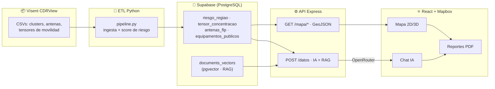

<div align="center">

# 🛰️ BiT — Panel de Datos Públicos

**Herramienta de decisión con IA para gestores públicos.**
Cruza concentración de personas y cobertura de red (dataset Vísent CDRView) con indicadores sociales para mostrar **dónde, cómo y por qué** se concentran las desigualdades digitales — antes de que se profundicen.

[**🌐 Demo en vivo**](https://s06-26-nc-equipo-69-b2g-frontend.vercel.app) · [Definición del MVP](./docs/MVP_Definicion.md) · [Casos de uso](./docs/Casos_de_Uso.md)


</div>

---

## ✨ ¿Qué hace?

Un gestor público entra, ve el territorio y le pregunta a los datos en lenguaje natural:

> *"¿Dónde hay concentración de personas pero cobertura de red precaria?"*

BiT le responde con evidencia: análisis generado por IA sobre datos reales, zonas resaltadas en el mapa y un reporte PDF listo para llevar a una reunión.

| | Funcionalidad |
|---|---|
| 🗺️ | **Mapa interactivo 2D/3D** — 27 zonas con score de riesgo, heatmap de concentración por franja horaria, antenas, corredores de movilidad animados e instituciones públicas. Modo 3D con columnas de riesgo y cámara cinemática que vuela a las zonas que la IA destaca. |
| 🤖 | **Agente IA con RAG** — chat en lenguaje natural sobre `POST /datos`: contexto recuperado por similitud vectorial (pgvector), memoria conversacional por usuario, hilos persistentes y selector de modelo (DeepSeek, GPT-4o mini, Gemini, Claude, Llama). Respuestas ancladas a datos reales con validación anti-alucinación de zonas. |
| ⚖️ | **Comparador de zonas** — seleccionás 1+ zonas priorizadas por riesgo y la IA genera la comparativa con tabla y sugerencia estratégica. |
| 📄 | **Reportes PDF** — exportá el reporte territorial completo, una comparativa o cualquier respuesta del chat con datos, con un click y sin backend. |
| 🔐 | **Login con Google** — Supabase Auth + JWT propio del backend; las consultas de IA y las conversaciones son por usuario. |
| 📱 | **Responsive real** — layouts dedicados para mobile (sheets, gestos táctiles, FAB de chat), no solo reflow. |

---

## 🏗️ Cómo funciona



### Score de riesgo territorial

Cada zona se puntúa combinando tres dimensiones calculadas por el pipeline ETL:

```
score = 0.45 × infraestructura + 0.25 × concentración + 0.30 × vulnerabilidad
```

- **Infraestructura**: congestión de red, caída de señal y % de tecnología legada (3G)
- **Concentración**: usuarios de la zona relativos a la zona más poblada
- **Vulnerabilidad**: proporción de población de ingresos bajos (rangos C/D)

Nivel de riesgo: **ALTO** ≥ 0.66 · **MEDIO** ≥ 0.33 · **BAJO** < 0.33. Metodología completa en la página [/metodologia](https://s06-26-nc-equipo-69-b2g-frontend.vercel.app/metodologia) de la app.

---

## 📂 Estructura del monorepo

```
├── frontend/        ⚛️  Web app responsiva (React 19 + Vite + Tailwind + Mapbox GL)
├── backend/         ⚙️  API REST (Express + Supabase + OpenRouter)
├── etl-pipeline/    🐍  Ingesta del dataset CDRView y cálculo de riesgo (Python)
├── supabase/        🐘  Migraciones SQL (schema, RPCs, pgvector)
└── docs/            📚  MVP, casos de uso, dataset, prompt de IA, deploy
```

---

## 🚀 Puesta en marcha

Requisitos: **Node 20+**, **pnpm 9+**, **Python 3.11+** (solo para el ETL).

```bash
pnpm install

# Todo el monorepo en modo dev (Turborepo)
pnpm dev

# O cada frente por separado
pnpm dev:frontend   # http://localhost:5173
pnpm dev:backend    # http://localhost:3000
```

### Variables de entorno

**`frontend/.env`**

| Variable | Descripción |
|---|---|
| `VITE_API_URL` | URL del backend (vacío = mismo origen) |
| `VITE_SUPABASE_URL` / `VITE_SUPABASE_ANON_KEY` | Proyecto Supabase (auth con Google) |
| `VITE_USE_MAPBOX` | `true` para habilitar el mapa |
| `VITE_API_KEY_MAPBOX` | Token público de Mapbox |

**`backend/.env`** — plantilla completa en [`backend/.env.example`](./backend/.env.example)

| Variable | Descripción |
|---|---|
| `SUPABASE_URL` / `SUPABASE_ANON_KEY` | Proyecto Supabase |
| `SUPABASE_SERVICE_ROLE_KEY` | Persistencia de conversaciones y preferencias (opcional en dev) |
| `OPENROUTER_API_KEY` | LLM real vía OpenRouter — **sin esta clave la IA responde en modo mock** |
| `OPENROUTER_MODEL` / `EMBED_MODEL` | Modelo de chat por defecto y modelo de embeddings |
| `JWT_SECRET` / `JWT_EXPIRES_IN` | Firma de la sesión propia del backend |
| `DATABASE_URL` / `DIRECT_URL` | Conexión Postgres para tooling y migraciones |

> 🔑 Nunca commitear `.env`, tokens ni `project_ref`.

### Pipeline ETL (carga del dataset)

```bash
cd etl-pipeline
pip install -r requirements.txt
# Colocar los CSVs de CDRView en data/referencias y data/tensores
python scripts/run_etl.py     # ingesta + score de riesgo → Supabase
pytest tests/ -v              # tests unitarios del pipeline
```

### Validaciones

```bash
pnpm check     # lint + test + build de todo el monorepo
```

Migraciones de base de datos: `pnpm db:migrate:status`, `pnpm db:migrate`, `pnpm db:migration:new <nombre>` (requiere Supabase CLI vinculado).

---

## 🔌 API principal

Base: `/api/v1` — documentación interactiva en `/docs` (Swagger) del backend.

| Endpoint | Descripción |
|---|---|
| `POST /datos` 🔒 | Consulta en lenguaje natural → respuesta IA + zonas destacadas + fuentes |
| `GET /mapa/clusters` | 27 zonas con score de riesgo (GeoJSON) |
| `GET /mapa/concentracao?periodo=` | Heatmap de concentración por franja horaria |
| `GET /mapa/equipamentos?categoria=` | Instituciones públicas (salud, educación, asistencia, gobierno) |
| `GET /mapa/od` · `GET /mapa/demografia` | Flujos origen-destino y perfil demográfico agregado |
| `GET/POST /models` | Modelos de IA disponibles y preferencia por usuario |
| `GET/DELETE /conversations` 🔒 | Hilos de conversación persistentes |
| `POST /auth/session` | Intercambio de token Supabase → JWT del backend |

🔒 = requiere sesión (Google login).

---

## 📊 Fuentes de datos

- **[Vísent CDRView](https://github.com/wongola-bit/appbit)** — dataset núcleo del desafío: concentración de personas por zona y cobertura de red ERB (5G/4G/3G) con coordenadas reales de antenas Anatel (datos emulados). Detalle en [Contexto del Dataset](./docs/Dataset_Contexto.md).
- **OpenStreetMap (Overpass API)** — instituciones públicas de Florianópolis (salud, educación, asistencia social, gobierno).

Los indicadores de calidad de red y congestión son **estimaciones derivadas de la actividad de antenas**, no mediciones oficiales de campo — la app lo señala en cada vista.

---

## 📚 Documentación

| | |
|---|---|
| [Definición del MVP](./docs/MVP_Definicion.md) | Visión de producto y los 5 servicios |
| [Casos de Uso](./docs/Casos_de_Uso.md) | Flujos del gestor público |
| [Contexto del Dataset](./docs/Dataset_Contexto.md) | CDRView: columnas, alcance y preguntas que responde |
| [System Prompt de IA](./docs/Prompt_IA.md) | Diseño del agente BiT |
| [Integración frontend ↔ mapa](./docs/frontend-mapa-integracion.md) | Contratos de los endpoints de mapa |
| [Workflow](./docs/workflow.md) · [Deploy](./docs/deploy.md) | Convenciones del equipo y despliegue |

---

<div align="center">

**Equipo 69** · Hackathon No-Country · Desafío B2G

*Construido para que las políticas de inclusión digital lleguen antes que las brechas.*

</div>
